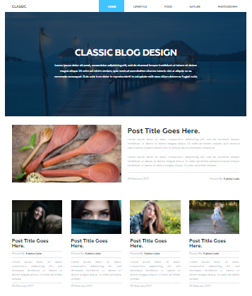

# Blog application on Django

---

> Django Blog step by step

### Steps

---

1. [Set Django project](readmefiles/set-django.md)
2. [Controller for main page](readmefiles/controller.md)
3. [Transition template to the project](readmefiles/transition.md)
4. [Project models](readmefiles/models.md)
4. [Admin panel, registering models in admin panel](readmefiles/admin-panel.md)

### Helpers

---

- [markdown helpers](readmefiles/md-helpers.md)