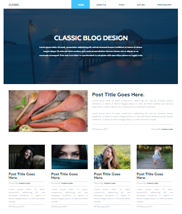

# Blog application on Django

---

> Here you can create your first simple Django Blog project step by step

## Installation this project

---

- Set [Python](https://www.python.org/)
- Set Editor, personally I prefer [PyCharm](https://www.jetbrains.com/ru-ru/pycharm/)
- Create directory where do you want to create project
- Add virtual environment `python -m venv venv`
- Install Django - `pip install -r requirements.txt`

## Steps for create project

---

1. [Set Django project](documentation/set-django.md)
2. [Controller for main page](documentation/controller.md)
3. [Transition template to the project](documentation/transition.md)
4. [Project models](documentation/models.md)
5. [Admin panel, registering models in admin panel](documentation/admin-panel.md)
6. [Setting up the panel admin](documentation/setting-up-admin-panel.md)
7. [Tag template menu](documentation/setting-up-admin-panel.md)
8. [Highlighting active path menu item](documentation/hightlighting active path.md)
9. [Displaying articles on the main](documentation/displaying_articles_on_main.md)
10. [Pagination for articles](documentation/pagination for articles.md)
11. [Posts for categories](documentation/posts for categories.md)
12. [Show posts for tag](documentation/show posts for tag.md)
13. [Show posts for tag_2](documentation/show posts for tag 2.md)
14. [Show posts for tag_2](documentation/show posts for tag 2.md)
15. [Show popular posts](get-popular-posts.md)
16. [Cloud tags](get-tags.md)

### Usefull links

---

- [markdown helpers](documentation/md-helpers.md)
- [how to add requirement.txt](https://coderoad.ru/29938554/%D0%9A%D0%B0%D0%BA-%D1%81%D0%BE%D0%B7%D0%B4%D0%B0%D1%82%D1%8C-requirements-txt)

