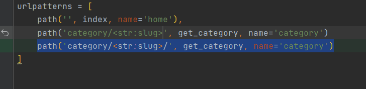

## Highlighting active path menu item

---

1. dartblog/static/js/active.js
```javascript
// Для каждого пункта меню с тегом a    
    $('.menu a').each(function () {
        // находим url страницы на которой находимся
        let location = window.location.protocol = '//' + window.location.host + window.location.pathname;
        // находим ссылку
        let link = this.href;
        // если локация равна ссылке добавляем класс active
        if (location == link) {
            $(this).parent().addClass('active')
        }
    })
```

2. fix

- Обрати внимание на ссылку в конце всегда должен быть '/'

