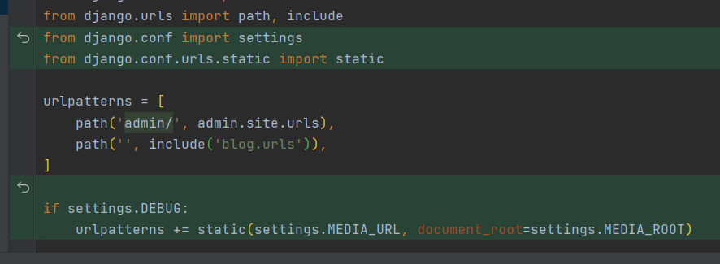
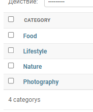
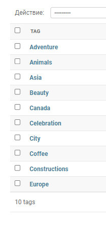
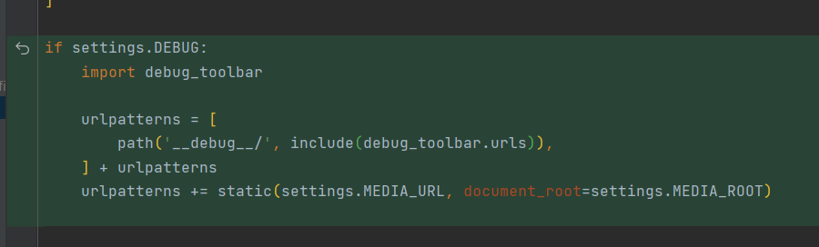
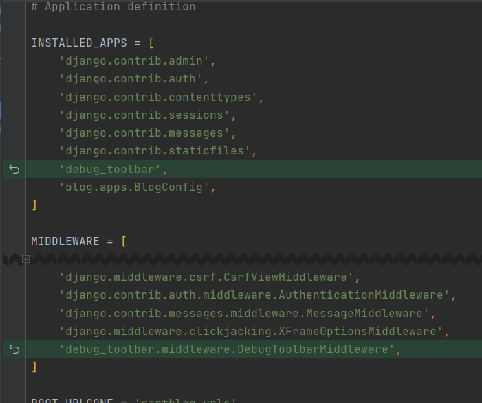
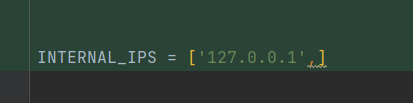

## Registering models in admin panel

---

1. Add variables for upload media files

```python
# куда помещать выгружаемые файлы
# в корневой папке появится папка медиа куда будем складировть все файлы
MEDIA_ROOT = os.path.join(BASE_DIR, 'media')
MEDIA_URL = '/media/'
```
2. Allow server serve uploaded files from user in catalog MEDIA_ROOT
> Эти две строки позволяют серверу разработки обслуживать загруженные пользователем файлы в каталоге MEDIA_ROOT .

> Вы не должны делать этого в производстве, поэтому добавляется проверка if settings.DEBUG . В рабочей среде вы должны настроить свой сервер (например, Nginx или Apache) для обслуживания media и статических файлов или для обслуживания их из CDN.

> Это явно означает, что если он находится в режиме разработки, а не в режиме производства



3. Create superuser `python manag.py  createsuperuser`
4. Register models in admin panel and add prepopulated field in blog/admin.py
```python
from django.contrib import admin

# Register your models here.
from .models import *

class PostAdmin(admin.ModelAdmin):
    # предварительно заполненные поля
    prepopulated_fields = {"slug": ("title",)}

class CategoryAdmin(admin.ModelAdmin):
    # предварительно заполненные поля
    prepopulated_fields = {"slug": ("title",)}

class TagAdmin(admin.ModelAdmin):
    # предварительно заполненные поля
    prepopulated_fields = {"slug": ("title",)}


admin.site.register(Post, PostAdmin)
admin.site.register(Category, CategoryAdmin)
admin.site.register(Tag, TagAdmin)
```

> prepopulated field allows autocomplete slug fields

> [slug-field](https://djbook.ru/rel3.0/ref/models/fields.html#django.db.models.SlugField)

> [prepopulated_fields ](https://djbook.ru/rel3.0/ref/contrib/admin/index.html#django.contrib.admin.ModelAdmin.prepopulated_fields)

5. Than add categories and tags


   


6. Install debug

[debug](https://pypi.org/project/django-debug-toolbar/)

7. `pip install django-debug-toolbar`

8. Documentation for debug

[debug documentation](https://django-debug-toolbar.readthedocs.io/en/latest/installation.html#getting-the-code)

9. Add to project dartblog/urls.py







10. django ckeditor `pip install django-ckeditor'

[ckeditor](https://pypi.org/project/django-ckeditor/)

11. add to installed apps `'ckeditor',`

12. `python manage.py collectstatic`

13. dartblog/settings.py
`CKEDITOR_BASEPATH = "/my_static/ckeditor/ckeditor/"`
    
14. Add `ckeditor` to your `INSTALLED_APPS` setting.
    
14. dartblog/urls.py `path('ckeditor/', include('ckeditor_uploader.urls')),`
    
15. Run the `collectstatic`


16. dartblog/urls.py `path('ckeditor/', include('ckeditor_uploader.urls')),`

17. blog/admin.py

```python
from django import forms
from ckeditor_uploader.widgets import CKEditorUploadingWidget

...

class PostAdminForm(forms.ModelForm):
    content = forms.CharField(widget=CKEditorUploadingWidget())

    class Meta:
        model = Post
        fields = '__all__'

# Register your models here.
class PostAdmin(admin.ModelAdmin):
    # предварительно заполненные поля
    prepopulated_fields = {"slug": ("title",)}
    # добавлена форма для админки ckeditor
    form = PostAdminForm
```

18. dartblog/settigns.py

```python
CKEDITOR_UPLOAD_PATH = "uploads/"

CKEDITOR_CONFIGS = {
    'default': {
        'skin': 'moono',
        'toolbar_Basic': [
            ['Source', '-', 'Bold', 'Italic']
        ],
        'toolbar_YourCustomToolbarConfig': [
            {'name': 'document', 'items': ['Source', '-', 'Save', 'NewPage', 'Preview', 'Print', '-', 'Templates']},
            {'name': 'clipboard', 'items': ['Cut', 'Copy', 'Paste', 'PasteText', 'PasteFromWord', '-', 'Undo', 'Redo']},
            {'name': 'editing', 'items': ['Find', 'Replace', '-', 'SelectAll']},
            {'name': 'forms',
             'items': ['Form', 'Checkbox', 'Radio', 'TextField', 'Textarea', 'Select', 'Button', 'ImageButton',
                       'HiddenField']},
            '/',
            {'name': 'basicstyles',
             'items': ['Bold', 'Italic', 'Underline', 'Strike', 'Subscript', 'Superscript', '-', 'RemoveFormat']},
            {'name': 'paragraph',
             'items': ['NumberedList', 'BulletedList', '-', 'Outdent', 'Indent', '-', 'Blockquote', 'CreateDiv', '-',
                       'JustifyLeft', 'JustifyCenter', 'JustifyRight', 'JustifyBlock', '-', 'BidiLtr', 'BidiRtl',
                       'Language']},
            {'name': 'links', 'items': ['Link', 'Unlink', 'Anchor']},
            {'name': 'insert',
             'items': ['Image', 'Flash', 'Table', 'HorizontalRule', 'Smiley', 'SpecialChar', 'PageBreak', 'Iframe']},
            '/',
            {'name': 'styles', 'items': ['Styles', 'Format', 'Font', 'FontSize']},
            {'name': 'colors', 'items': ['TextColor', 'BGColor']},
            {'name': 'tools', 'items': ['Maximize', 'ShowBlocks']},
            {'name': 'about', 'items': ['About']},
            '/',  # put this to force next toolbar on new line
            {'name': 'yourcustomtools', 'items': [
                # put the name of your editor.ui.addButton here
                'Preview',
                'Maximize',

            ]},
        ],
        'toolbar': 'YourCustomToolbarConfig',  # put selected toolbar config here
        # 'toolbarGroups': [{ 'name': 'document', 'groups': [ 'mode', 'document', 'doctools' ] }],
        # 'height': 291,
        # 'width': '100%',
        # 'filebrowserWindowHeight': 725,
        # 'filebrowserWindowWidth': 940,
        # 'toolbarCanCollapse': True,
        # 'mathJaxLib': '//cdn.mathjax.org/mathjax/2.2-latest/MathJax.js?config=TeX-AMS_HTML',
        'tabSpaces': 4,
        'extraPlugins': ','.join([
            'uploadimage', # the upload image feature
            # your extra plugins here
            'div',
            'autolink',
            'autoembed',
            'embedsemantic',
            'autogrow',
            # 'devtools',
            'widget',
            'lineutils',
            'clipboard',
            'dialog',
            'dialogui',
            'elementspath'
        ]),
    }
}
```

