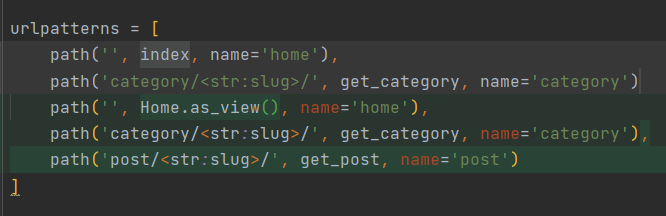

## Displaying articles on the main

---

1. Add Home view in views.py for home page
```python
class Home(ListView):
    model = Post
    template_name = 'blog/index.html'
    context_object_name = 'posts'
    paginate_by = 2

    def get_context_data(self, *, object_list=None, **kwargs):
        context = super().get_context_data(**kwargs)
        context['title'] = 'Classic Blog Design'
        return context
```

2. change blog/urls.py from index to Home.as_view()



3. add title block

```python
{{ title }} :: {{ block.super }}  
```

- where title we get from context 

4. models.py - get absolut url for post
```python
class Post:
    ...
def get_absolute_url(self):
        return reverse('post', kwargs={"slug": self.slug})
```
- url for post urls.py
```python
path('post/<str:slug>/', get_post, name='post')
```
5. Select the post block and display posts through a loop

```html

<div class="col-md-3">
    <div class="single-post">

        
            
        
            
        

        <h3><a href="{{ post.get_absolute_url }}">{{ post.title}}</a></h3>
        <h4><span>Posted By: <span class="author-name">{{ post.author }}</span></span>
        </h4>
        <p>{{ post.content|truncatewords_html:20|striptags }}</p>
        <h4><span>{{ post.created_at|date:"d/m/Y" }}</span></h4>
    </div>
</div>

```
