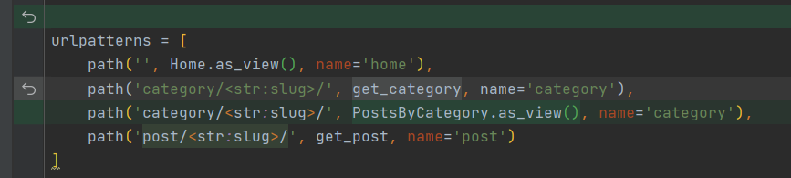

## Posts for categories

---

1. View for posts for categories
```python
class PostsByCategory(ListView):
    template_name = 'blog/index.html'
    context_object_name = 'posts'
    paginate_by = 4
    allow_empty = False

    def get_queryset(self):
        return Post.objects.filter(category__slug=self.kwargs['slug'])

    def get_context_data(self, *, object_list=None, **kwargs):
        context = super().get_context_data(**kwargs)
        context['title'] = Category.objects.get(slug=self.kwargs['slug'])
        return context

```

2. Change urls.py
